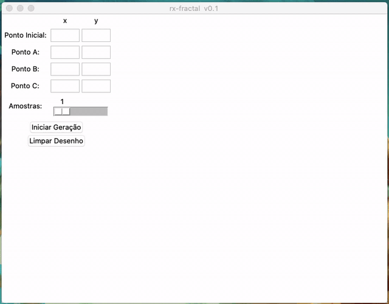
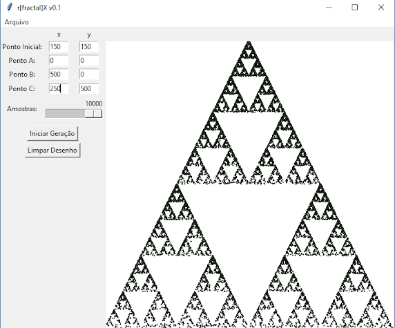

rFractal[X]
------------

This is a python3/tk written software to generate a fractal between 3 points given random numbers.

Features:
- 500x500 canvas
- Generates 10000 max points for each iteration
- Brazillian Portuguese (pt_BR) interface 

Binaries:
- Binaries are provided for Windows 10 - 64bits 

Explanation:
- This is better used after watching this video: 

Screenshot
----------

